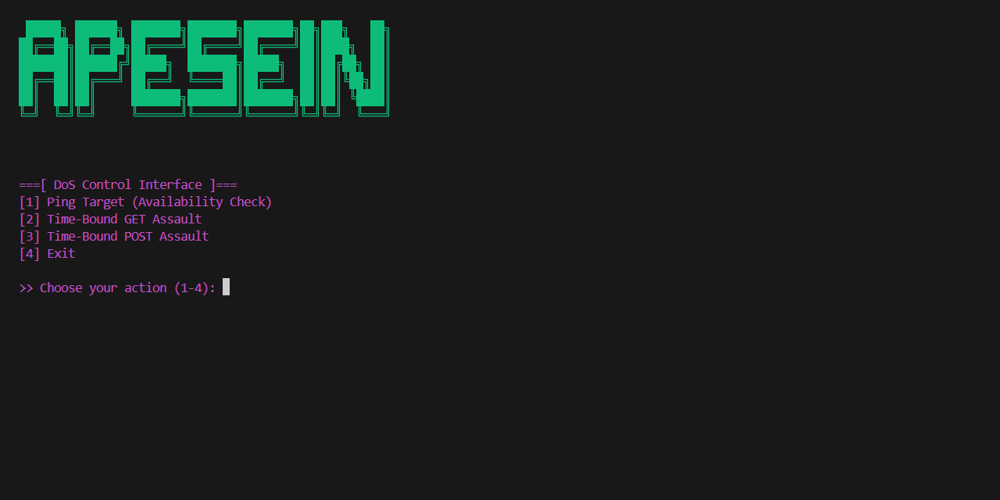

# apesein

HTTP DDoS tool for ethical testing.
<p align="center">
  
</p>

## Features
- HTTP GET/POST flooding
- CLI-based control
- Lightweight & simple

> **Warning**: For educational and authorized testing only.

## Installation
Clone the repository:
```bash
git clone https://github.com/username/apesein.git
cd apesein
pip install -r requirements.txt

## Usage
Run the script:
```bash
python apesein.py
```

## Requirements
- Python 3.8+
- `requests`, `colorama`

## File Structure
- `apesein.py` — Main script
- `requirements.txt` — Dependencies
- `.gitignore` — Ignores `__pycache__`, etc.

## Disclaimer
Use only on systems you own or have explicit permission to test. Unauthorized use is illegal.

## License
MIT © 2025
